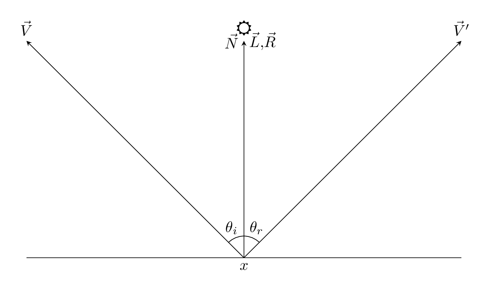
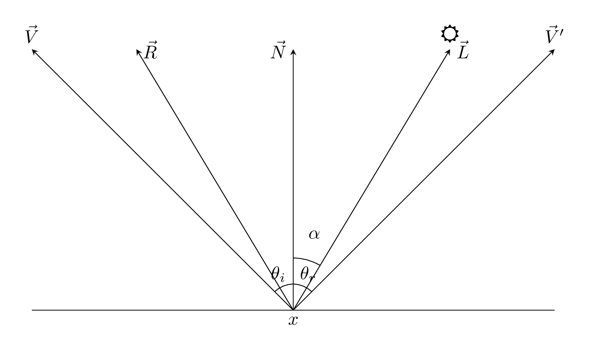
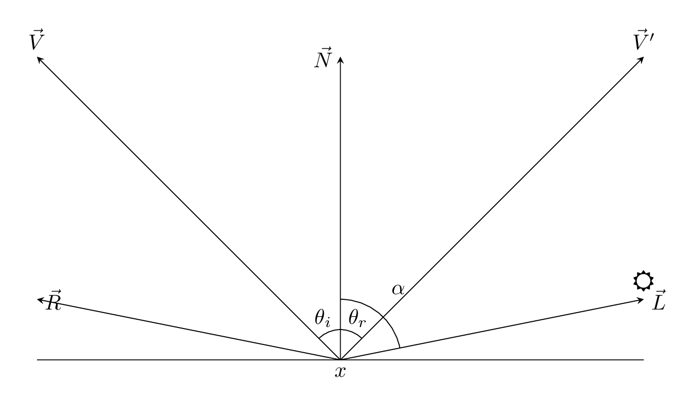

# Radiometry Recap, Light Attenuation

## Radiometry Recap

**What to measure in a simulation?**

Radiant flux (or power)
: Total amount of energy passing through a surface (measured per second).
  $$ \Phi \left[W\right]$$

It is not good to measurethe radiant flux , because it is the energy per
surface, so a large radiant flux could either be

1. A lot of energy over a small surface.
2. A little energy over a large surface.

This metric is ambiguious, and thus it is not good enough.

Lets comput the flux by unit area (irradiance).
$$E\left[W/m^2\right]$$

This is still ambiguous, we haven't fixed the angle wihc the ligh arives to the
surface. So

1. A lot of energy in a huge angle.
2. A little energy in a small angle.

will measure the same irradiance.

Compute the flux by unit area and unit angle(radiance).
$$L\left[W/\left(m^2\cdot sr\right)\right]$$

*Note:* angle in more diemsions is called solid angle, for which the unit is
steradians.

This is the measurement that we will be using to measure.

## The most fundamental question

**How much light exiss a surface point in a given direction?**

The answer is given by Maxwell equations!

In practice, we don't do this, it would be too complicated.

The real solution is the rendering equation!

## The scalar product
$$
\vec{a}\cdot\vec{b}\equiv||\vec{a}||\cdot||\vec{b}||\cos\theta
$$

We will usualy use vectors of unit length, so
$$
\vec{a}\cdot\vec{b}\equiv\cos\theta
$$

## Terminology

* $\vec{V}$ direction towards the viewer (eye,camera)
* $\vec{N}$ surface normal
* $\vec{L}$ vector point towards the light source
* $\vec{R}$ reflected ray direction
  $\vec{R}=\vec{L}-2\vec{N}\left(\vec{L}\cdot\vec{N}\right)$.
* $\theta_i,\theta_r$ incident and reflected angles

Vectors are always pointing out form the point $x$.

## Light Attenuation

When the sun is directly above as in the prvious figure.
$$
\left(\vec{L}\cdot\vec{N}\right)\Phi=\cos0\Phi=\Phi
$$

If the sun is off to one side as in this figure if $\alpha\approx45^\circ$.

$$
\left(\vec{L}\cdot\vec{N}\right)\Phi=\cos\alpha\Phi\approx 0.7\Phi
$$

If the sun is near $90^\circ$, as in this figure, where
$\alpha\approx90^\circ$.

$$
\left(\vec{L}\cdot\vec{N}\right)\Phi=\cos\alpha\Phi\approx 0
$$

Thus we can model the light attenuation using this dot product.
